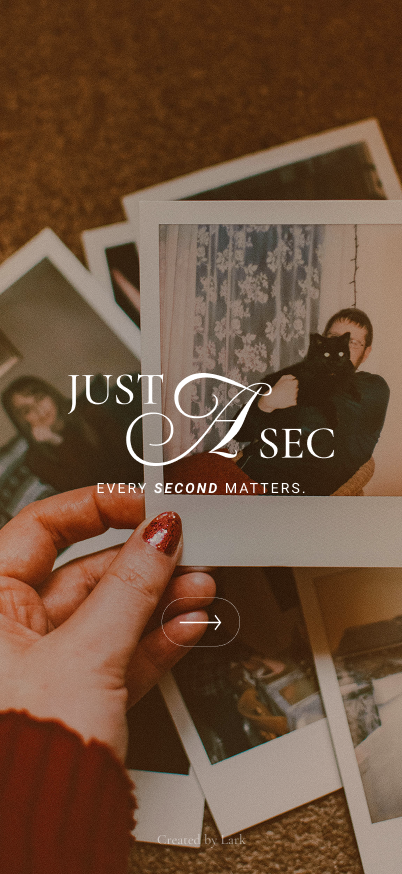

<!-- Improved compatibility of back to top link: See: https://github.com/othneildrew/Best-README-Template/pull/73 -->

<a id="readme-top"></a>

<!-- PROJECT SHIELDS -->
<!-- Reference style links for readability; see bottom for variables -->

[![Contributors][contributors-shield]][contributors-url]
[![Forks][forks-shield]][forks-url]
[![Stargazers][stars-shield]][stars-url]
[![Issues][issues-shield]][issues-url]
[![LinkedIn][linkedin-shield]][linkedin-url]

<!-- PROJECT LOGO -->
<div align="center">
  <a href="https://github.com/Snorlark/just-a-sec">
    
  </a>

  <h1 align="center">Just a Sec</h1>

  <p align="center">
    A lightweight, offline-first Flutter app for capturing 1‑second clips and local memories.
    <br />
    <a href="https://github.com/Snorlark/just-a-sec"><strong>Explore the docs »</strong></a>
    <br />
    <br />
    <a href="./app-demo.mp4">View Demo (video)</a>
    &middot;
    <a href="https://github.com/Snorlark/just-a-sec/issues">Report Bug</a>
    &middot;
    <a href="https://github.com/Snorlark/just-a-sec/issues">Request Feature</a>
  </p>
</div>

<!-- TABLE OF CONTENTS -->
<details>
  <summary>Table of Contents</summary>
  <ol>
    <li>
      <a href="#about-the-project">About The Project</a>
      <ul>
        <li><a href="#built-with">Built With</a></li>
        <li><a href="#key-features">Key Features</a></li>
      </ul>
    </li>
    <li>
      <a href="#getting-started">Getting Started</a>
      <ul>
        <li><a href="#prerequisites">Prerequisites</a></li>
        <li><a href="#installation">Installation</a></li>
        <li><a href="#environment-variables">Environment Variables</a></li>
      </ul>
    </li>
    <li><a href="#project-structure">Project Structure</a></li>
    <li><a href="#architecture">Architecture</a></li>
    <li><a href="#features">Features</a></li>
    <li><a href="#deployment">Deployment</a></li>
    <li><a href="#roadmap">Roadmap</a></li>
    <li><a href="#contributing">Contributing</a></li>
    <li><a href="#contact">Contact</a></li>
    <li><a href="#acknowledgments">Acknowledgments</a></li>
  </ol>
</details>

<!-- ABOUT THE PROJECT -->

## About The Project

<p align="center">
  
</p>

Just a Sec is a simple, distraction‑free way to capture a single second of your day. Add a caption, save locally, and revisit your timeline — no account, no server, no internet required.

### Why Just a Sec?

- **Offline‑first**: Works reliably without internet; data is stored locally
- **Privacy by default**: Your clips live on your device (Hive storage)
- **Purposefully short**: 1‑second constraint keeps memories quick and consistent

<p align="right">(<a href="#readme-top">back to top</a>)</p>

### Built With

- Flutter
- Provider
- Google Fonts
- Hive + hive_flutter
- camera, image_picker, image_cropper
- video_player
- flutter_screenutil
- flutter_svg
- geolocator
- flutter_dotenv (non‑sensitive config)

<p align="right">(<a href="#readme-top">back to top</a>)</p>

### Key Features

- 📷 1‑second video capture with countdown overlay
- 💾 Local‑only persistence for clips, captions, and profile data
- 🎨 Light/Dark theming, responsive UI
- 🖼 Optional gallery uploads for profile or stories

<p align="right">(<a href="#readme-top">back to top</a>)</p>

<!-- GETTING STARTED -->

## Getting Started

Follow these steps to run locally.

### Prerequisites

- Flutter SDK installed
- Platform setup
  - iOS: Xcode + CocoaPods
  - Android: Android Studio + SDKs

### Installation

```bash
# Clone
git clone https://github.com/Snorlark/just-a-sec.git
cd just-a-sec

# Install packages
flutter pub get

# (Optional) Non‑sensitive env values
# If allowed, create a .env with placeholders (HOST, etc.)
```

### Environment Variables

This app uses `flutter_dotenv` for simple, non‑sensitive configuration. Keep secrets out of `.env` in public repos.

- `HOST`: optional base host string for future integrations

Note: `.env` is listed under assets in `pubspec.yaml`; only include safe placeholders if committed.

<p align="right">(<a href="#readme-top">back to top</a>)</p>

## Project Structure

```
lib/
├─ main.dart                # Entry; loads .env and boots the app
├─ app.dart                 # MaterialApp, routes, theming
├─ config/
│  ├─ theme.dart            # Colors, typography
│  ├─ constants.dart        # Shared constants (reads HOST)
│  └─ app_spacing.dart      # Spacing helpers
├─ models/                  # Hive models (user, story, article)
├─ providers/               # Theme provider
├─ services/                # camera, storage, article, etc.
├─ screens/                 # splash, register, home, profile, etc.
├─ utils/                   # format_date.dart
└─ widgets/                 # reusable widgets
```

<p align="right">(<a href="#readme-top">back to top</a>)</p>

## Architecture

A simple on‑device architecture:

```
UI (Flutter Widgets)
   │
   ├── Services (Camera, Storage)
   │       └─ Hive (local boxes) + File system (video clips)
   │
   └── Providers (Theme)
```

Design choices:

- **Local‑first**: no backend; clips are files, metadata in Hive
- **Separation of concerns**: UI ↔ services ↔ storage
- **Minimal dependencies**: focused on reliability and portability

<p align="right">(<a href="#readme-top">back to top</a>)</p>

## Features

- Capture 1‑second video clips
- Add captions and view in a simple gallery
- Profile avatar and basic settings
- Responsive layout with `flutter_screenutil`

<p align="right">(<a href="#readme-top">back to top</a>)</p>

## Deployment

Build release binaries:

```bash
# Android (APK)
flutter build apk --release

# Android (AppBundle)
flutter build appbundle --release

# iOS
flutter build ios --release
```

<p align="right">(<a href="#readme-top">back to top</a>)</p>

## Roadmap

- [ ] Export/share clips
- [ ] Optional encrypted cloud backup (opt‑in)
- [ ] Basic effects/filters
- [ ] Local analytics and insights

See the issues for more ideas and requests.

<p align="right">(<a href="#readme-top">back to top</a>)</p>

## Contributing

Contributions are welcome for small, focused improvements (docs, minor UX, bug fixes). Please keep changes simple and aligned with the offline‑first principle.

1. Fork the project
2. Create your feature branch (`git checkout -b feature/YourFeature`)
3. Commit your changes (`git commit -m 'feat: add YourFeature'`)
4. Push to the branch (`git push origin feature/YourFeature`)
5. Open a Pull Request

<p align="right">(<a href="#readme-top">back to top</a>)</p>

## Contact

**Lark Sigmuond Babao** — larksigmuondbabao@gmail.com

- LinkedIn: https://www.linkedin.com/in/lark-sigmuond-babao-9a8a012b2/
- Portfolio: https://larkbabao-portfolio-5p93.vercel.app/
- GitHub: https://github.com/Snorlark
- Resume: https://babao-lark-resume.tiiny.site/

Project Link: https://github.com/Snorlark/just-a-sec

<p align="right">(<a href="#readme-top">back to top</a>)</p>

## Acknowledgments

- Flutter community and package authors
- Hive for local persistence
- Inspiration from daily memory journals

<p align="right">(<a href="#readme-top">back to top</a>)</p>

<!-- MARKDOWN LINKS & IMAGES -->

[contributors-shield]: https://img.shields.io/github/contributors/Snorlark/just-a-sec.svg?style=for-the-badge
[contributors-url]: https://github.com/Snorlark/just-a-sec/graphs/contributors
[forks-shield]: https://img.shields.io/github/forks/Snorlark/just-a-sec.svg?style=for-the-badge
[forks-url]: https://github.com/Snorlark/just-a-sec/network/members
[stars-shield]: https://img.shields.io/github/stars/Snorlark/just-a-sec.svg?style=for-the-badge
[stars-url]: https://github.com/Snorlark/just-a-sec/stargazers
[issues-shield]: https://img.shields.io/github/issues/Snorlark/just-a-sec.svg?style=for-the-badge
[issues-url]: https://github.com/Snorlark/just-a-sec/issues
[linkedin-shield]: https://img.shields.io/badge/-LinkedIn-black.svg?style=for-the-badge&logo=linkedin&colorB=555
[linkedin-url]: https://www.linkedin.com/in/lark-sigmuond-babao-9a8a012b2/
